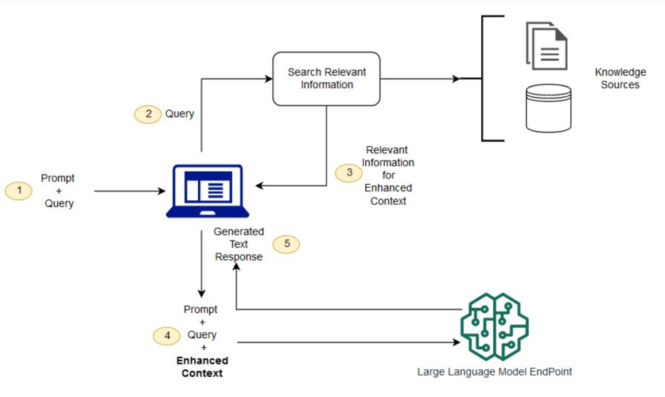

### Spring AI 학습 Toy Project 
- Vaadin [ React + SpringBoot (gradle version) ] Quick Start
- npm version 20+@
1. [openai Key 발급하기](https://platform.openai.com/docs/api-reference/introduction)
2. [youtube key 발급하기] (https://developers.google.com/youtube/v3/getting-started)
3. 발급한 key 를 IDE configuration 환경변수로 등록
   
4. application Running

